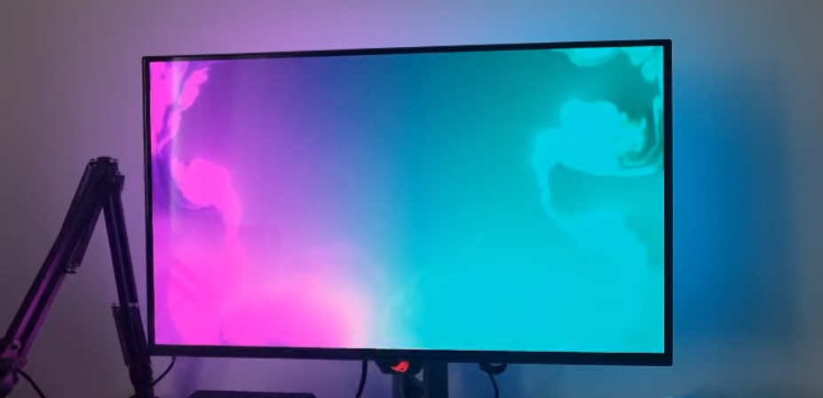

# win_ambilight

# Monitor Backlight Sync Project

This project is designed to synchronize monitor visuals with a USB-connected LED backlight strip, providing a smooth and stable ambient lighting experience.

## Requirements

- **Operating System**: Windows 8 or later  
- **Language/Tools**: C++20 and Visual Studio 2022  
- **USB Communication**: [libusb](https://github.com/libusb/libusb)

## Hardware

This project is developed for use with Robobloq’s  
**Backlight Strip for Monitor**  
Details: [https://quiklight.robobloq.com/sync-lights](https://quiklight.robobloq.com/sync-lights)

## Project Goal

The aim of the project is to capture screen content at high speed, process the pixels via a compute shader, and reflect the resulting colors onto the LED strip in a smooth and responsive way—minimizing harsh transitions and enhancing visual comfort.

---

Feel free to contribute or report any issues!
